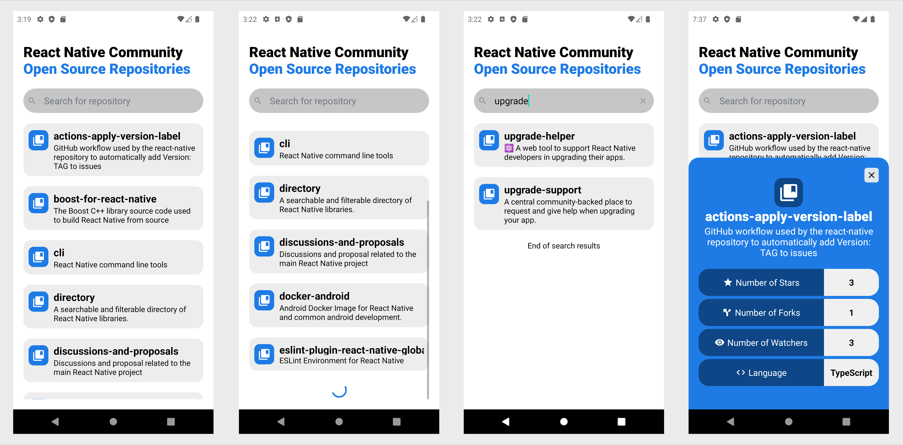

# RNC Repositories Android App

React Native app that shows the open source repositories of [React Native Community](https://github.com/react-native-community).

## Features
- List of open source RNC repositories, displaying the repository name and description.
- Search for RNC repositories through repository names.
- View details of a repository (name, description, no. of stars, no. of forks, no. of watchers, language)
  
## Requirements
- expo-cli
  
## Usage
Install dependencies

```npm install```

Start application: 

```npm start```

## Screenshots

